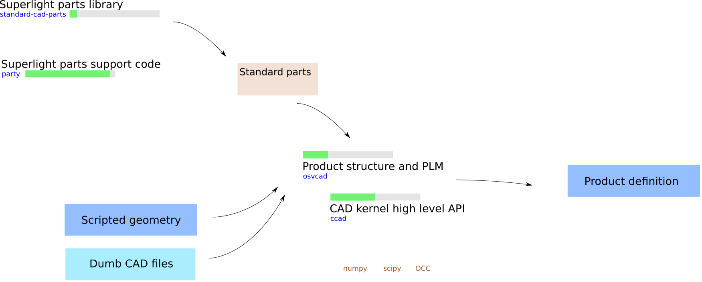

pyosv
=====

-- ** WARNING : WORK IN PROGRESS ** --

pyosv is about modelling physical products (think cars, boats, 3D printers ...) the open source way.

The pyosv project gathers several projects that brings us closer to that goal:

- `party <https://github.com/osv-team/party>`_ is the support/APi code that supports the creation and use of superlight parts libraries (kb instead of Mb or Gb). Its documentation is available on `Read the Docs <http://party.readthedocs.io/en/latest/>`_

- `standard-cad-parts <https://github.com/osv-team/standard-cad-parts>`_ is a (limited as of july 2017) collection of standardized parts (ISO screws, ISO nuts ...) that can be used to build more complex systems.

- `ccad <https://github.com/osv-team/ccad>`_ is a fork of Charles Sherman's ccad. It is a user friendly API to `PythonOCC <http://www.pythonocc.org/>`_.

- `osvcad <https://github.com/osv-team/osvcad>`_ uses ccad, party and standard-cad-parts to model physical products using acyclic directed graphs.

Python version
--------------

All projects are tested for Python 2.7 and Python 3.6 compatibility.

Install
-------

anaconda
~~~~~~~~

We recommend the use of Anaconda as your Python distribution. You can get it `here <https://www.continuum.io/downloads>`_

Anaconda comes with `numpy <http://www.numpy.org/>`_, `scipy <https://www.scipy.org/>`_ and `matplotlib <https://matplotlib.org/>`_ (among others) already included.

dependencies
~~~~~~~~~~~~

One of the main dependencies of **pyosv** is `PythonOCC <http://www.pythonocc.org/>`_

PythonOCC can be installed with conda (Anaconda package manager) :

.. code:: shell

  conda install -c pythonocc pythonocc-core=0.18

Other dependencies:

.. code:: shell

  conda install jinja2
  conda install networkx
  conda install -c anaconda wxpython

.. code:: shell

  pip install jsonpickle
  pip install pyqt5
  pip install aocutils

ccad
~~~~

.. code:: shell

  git clone https://github.com/osv-team/ccad
  cd ccad
  python setup.py install

party
~~~~~

.. code:: shell

  git clone https://github.com/osv-team/party
  cd party
  python setup.py install

standard-cad-parts
~~~~~~~~~~~~~~~~~~

.. code:: shell

  git clone https://github.com/osv-team/standard-cad-parts

osvcad
~~~~~~

.. code:: shell

  git clone https://github.com/osv-team/osvcad
  cd osvcad
  python setup.py install

