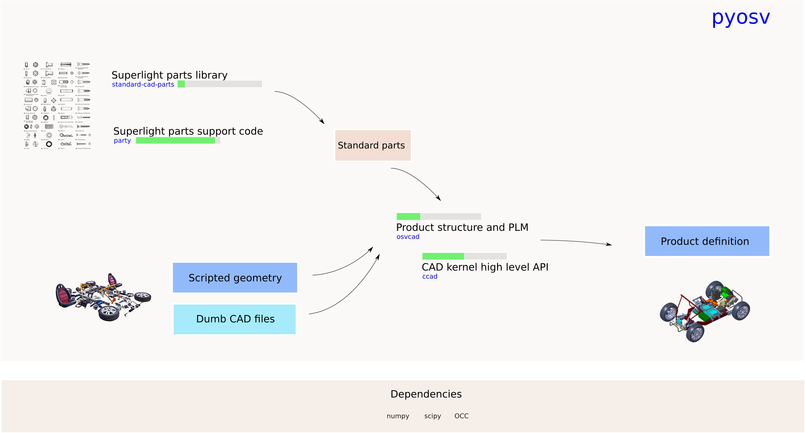

pyosv
=====

pyosv is about modelling physical products (think cars, boats, 3D printers ...) the open source way.

The pyosv project gathers several projects that brings us closer to that goal:

- `party <https://github.com/osv-team/party>`_ is the support/APi code that supports the creation and use of superlight parts libraries (kb instead of Mb or Gb). Its documentation is available on `Read the Docs <http://party.readthedocs.io/en/latest/>`_

- `standard-cad-parts <https://github.com/osv-team/standard-cad-parts>`_ is a (limited as of july 2017) collection of standardized parts (ISO screws, ISO nuts ...) that can be used to build more complex systems.

- `ccad <https://github.com/osv-team/ccad>`_ is a fork of Charles Sherman's ccad. It is a user friendly API to `PythonOCC <http://www.pythonocc.org/>`_.

- `osvcad <https://github.com/osv-team/osvcad>`_ uses ccad, party and standard-cad-parts to model physical products using acyclic directed graphs.

Install
-------

party
~~~~~

<tbc>

standard-cad-parts
~~~~~~~~~~~~~~~~~~

<tbc>

ccad
----

<tbc>

osvcad
~~~~~~

<tbc>

